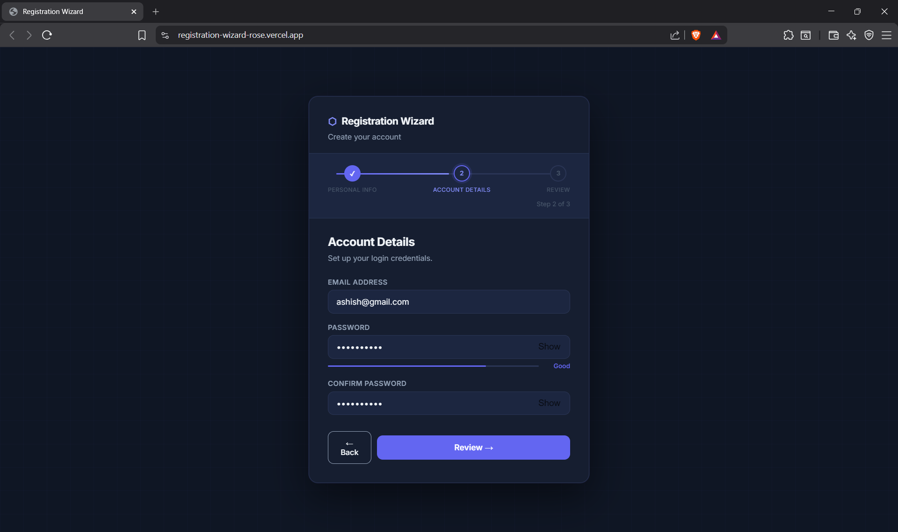
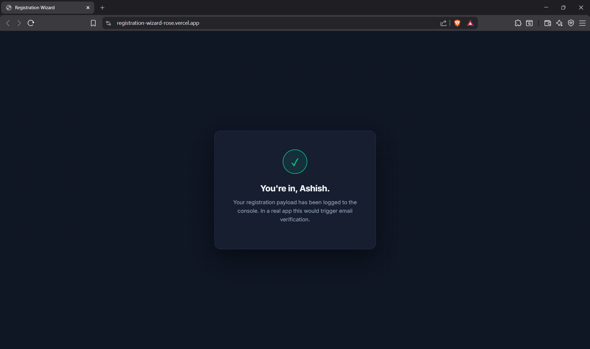
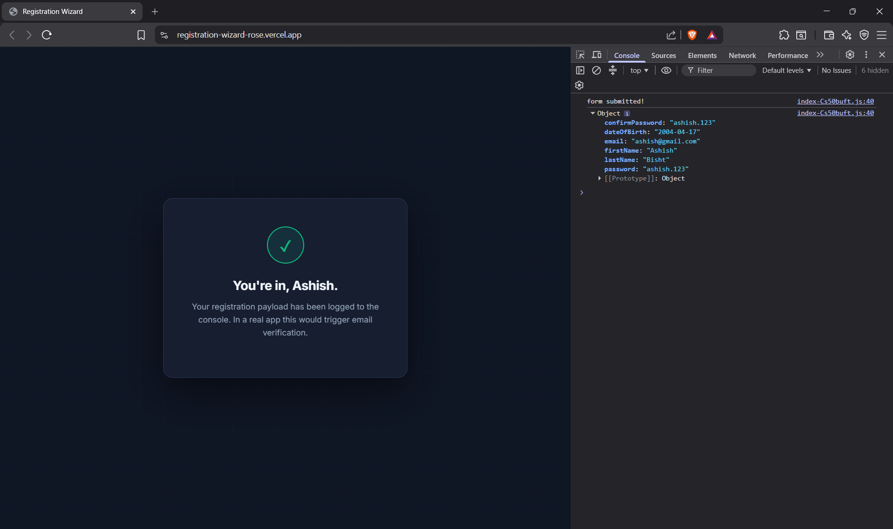

# The Registration Wizard

A multi-step onboarding wizard built in React + Vite. The kind of segmented, validated, state-persistent form you find in real SaaS and FinTech products — not a 20-field wall of inputs.

<br/>

| | |
|---|---|
| **Live Demo** | [link](after deployment) |
| **Repository** | [github.com/ashish-bisht-iot/registration-wizard](https://github.com/ashish-bisht-iot/registration-wizard) |

<br/>

---

## Screenshots

### Personal Information

> First name, last name, date of birth. The **Continue** button stays disabled until both name fields have at least 2 characters and a date is selected.


---

### Validation Errors

> Error messages only appear after the user has interacted with a field ("touched" state pattern). Empty form on load = no red errors.


---

### Account Details

> Email with regex validation, password with real-time strength meter, confirm password match check. Show/hide toggles on both password fields.


---

### Real-Time Error Messages

> Email error fires as soon as the format is wrong (missing @). Password strength meter updates on every keystroke. Confirm password mismatch shows immediately.


---

### Password Visible (Show/Hide Toggle)

> Eye icon toggles the input between `type="password"` and `type="text"`. Separate toggle for each password field — toggling one doesn't affect the other.


---

### Review & Submit

> Summary of all collected data before final submission. Password is masked with bullet characters (●). Back button still works here — data is preserved.


---

### Back Button — State Preserved

> This is the core feature of the sprint. Filled in Step 1 → navigated to Step 2 → clicked Back → **Step 1 data is still there.** This works because of lifted state.



---

### Success Screen

> Clicking Submit transitions to the success screen. The finalized payload is simultaneously logged to the browser console.



---

### Console Output — Finalized Payload

> `console.log(formData)` on submit shows the full registration object. In a real app, this would be a POST request to an API.




## How It's Built

### The Core Problem: State Across Steps

React's conditional rendering (`{step === 1 && <StepPersonal/>}`) doesn't *hide* a component — it *unmounts* it. When `step` changes to 2, `StepPersonal` is destroyed and its local state is gone. When you navigate back to step 1, React creates a brand-new `StepPersonal` with fresh initial values.

**Solution: Lift State Up**

Move all form data into `App.jsx`, which never unmounts:

```jsx
// App.jsx
const [formData, setFormData] = useState({
  firstName: '', lastName: '', dateOfBirth: '',
  email: '', password: '', confirmPassword: ''
})

function updateFormData(fields) {
  // Spread merge — each step only updates its own fields
  setFormData(prev => ({ ...prev, ...fields }))
}
```

Each step receives `formData` and `updateFormData` as props. Steps keep their own local state for smooth typing, and sync to the parent via `useEffect`:

```jsx
// Inside StepPersonal.jsx
const [local, setLocal] = useState({
  firstName: formData.firstName,
  lastName:  formData.lastName,
  dateOfBirth: formData.dateOfBirth,
})

// Whenever local changes, push it up to App
useEffect(() => {
  updateFormData(local)
}, [local])
```

---

### onChange Validation + Touched State

Two separate concerns — don't mix them:

1. **Validation runs on every render** — keeps `isValid` accurate for button disabling
2. **Errors only display after the field is touched** — no red errors on a blank form

```jsx
const [touched, setTouched] = useState({})

function handleChange(field, value) {
  setLocal(prev => ({ ...prev, [field]: value }))
  setTouched(prev => ({ ...prev, [field]: true }))  // mark as touched
}

// Validate always
const errors  = validate(local)
const isValid = Object.keys(errors).length === 0

// Display only if touched
<FormField
  error={touched.email ? errors.email : ''}
/>
```

---

### Email Regex

```js
const EMAIL_REGEX = /^[^\s@]+@[^\s@]+\.[^\s@]+$/
```

Breakdown:
- `^` — start of string
- `[^\s@]+` — one or more chars that are NOT whitespace and NOT @
- `@` — literal @ symbol
- `[^\s@]+` — domain name
- `\.` — literal dot (escaped — unescaped `.` means "any character")
- `[^\s@]+$` — domain extension, end of string

---

### Conditional Button Disabling

```jsx
const errors  = validate(local)
const isValid = Object.keys(errors).length === 0

<button
  type="button"
  disabled={!isValid}
  onClick={onNext}
>
  Continue →
</button>
```

React re-evaluates `isValid` on every state change. Button becomes enabled the instant all fields pass validation.

---

### Show/Hide Password

```jsx
const [showPassword, setShowPassword] = useState(false)

<input
  type={showPassword ? 'text' : 'password'}
  value={local.password}
  onChange={e => handleChange('password', e.target.value)}
/>
<button type="button" onClick={() => setShowPassword(s => !s)}>
  {showPassword ? '🙈' : '👁'}
</button>
```

Separate `showConfirm` state for the confirm password field — independent toggles.

---

## Project Structure

```
sprint07/
├── index.html
├── vite.config.js
├── package.json
├── Prompts.md                      ← AI debugging log (required)
├── README.md                       ← this file
└── src/
    ├── main.jsx                    ← React entry point
    ├── App.jsx                     ← lifted formData state, step control
    ├── App.css
    ├── index.css                   ← CSS variables, global reset
    └── components/
        ├── ProgressBar.jsx         ← step dots, connecting track, pulse animation
        ├── ProgressBar.css
        ├── FormField.jsx           ← reusable: label + input + error + suffix slot
        ├── FormField.css
        ├── StepPersonal.jsx        ← Step 1
        ├── StepAccount.jsx         ← Step 2 (email, password, show/hide)
        ├── StepReview.jsx          ← Step 3 (data summary)
        ├── StepReview.css
        ├── SuccessScreen.jsx       ← post-submit screen
        ├── SuccessScreen.css
        └── Steps.css               ← shared: buttons, field-row, strength bar

